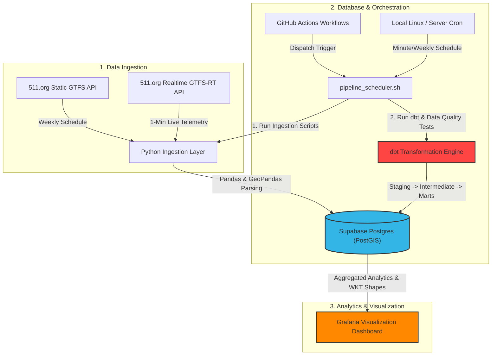
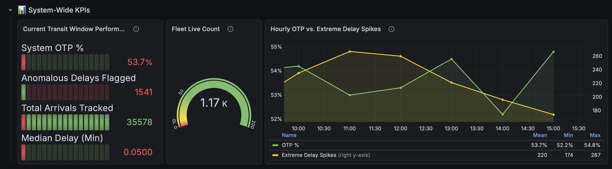
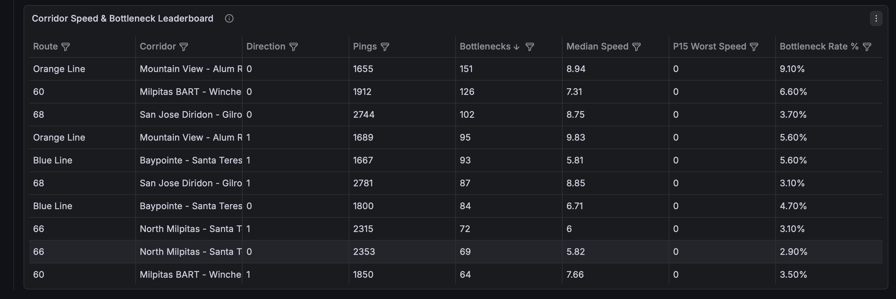
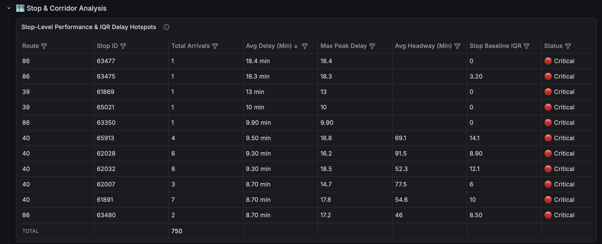
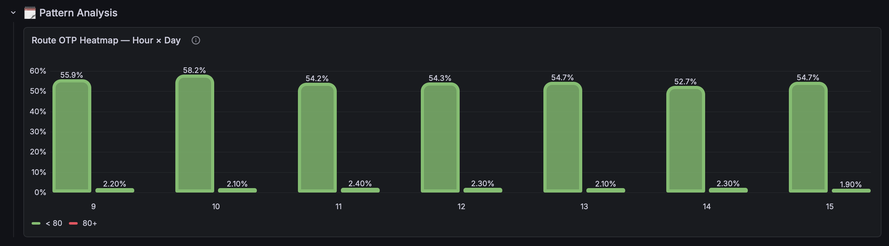
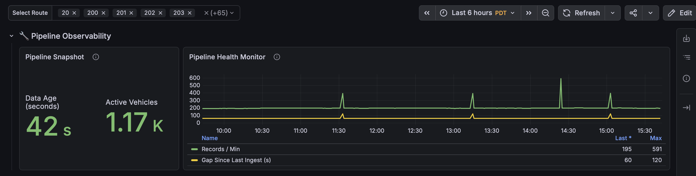

# 🚌 TransitPulse: Real-Time Transit Analytics Pipeline

[](https://www.getdbt.com/)
[](https://supabase.com/)
[](https://grafana.com/)
[](https://github.com/features/actions)
[](https://www.python.org/)

> 📊 **Dashboard Previews:** Scroll down to the [Analytics Dashboard & Visualizations](#-analytics-dashboard--visualizations) section to view system screenshots.

TransitPulse is a high-performance, real-time data engineering pipeline designed to ingest, process, transform, and visualize public transit performance telemetry. Focusing on the **Santa Clara Valley Transportation Authority (VTA)** network, the platform consumes raw, heterogeneous public transit feeds and produces high-value, actionable insights regarding on-time reliability, spatial bottleneck hotspots, and network-wide delay statistics.

---

## 🚀 Key Highlights & Impact

*   **Real-time Congestion Hotspot Mapping:** Translates raw GPS telemetry from active buses into spatial route corridor geometries, mapping out bottleneck sections where vehicles drop below 5 mph.
*   **On-Time Performance (OTP) Scoring:** Aggregates stop-level arrivals on an hourly schedule window, rating them as *On-Time* if they arrive between **1 minute early** and **5 minutes late** against the static scheduled GTFS.
*   **Dynamic Rolling Data Architecture:** Keeps a lean database size by running automatic sliding window housekeeps, maintaining a tight **48-hour active telemetry window** while exporting aggregations.
*   **Production-Grade Data Observability:** Comprehensive telemetry tracking active bus pings, ingestion rate stability, and processing latency to guarantee pipeline uptime and dashboard accuracy.

---

## 🏗️ Architecture Overview

The system is built as a robust modular pipeline, combining real-time Python ingestion, Postgres persistence, dbt analytical models, and a gorgeous Grafana dashboard.



### 1. Ingestion Pipeline (`Python 3.11`, `Pandas`, `GeoPandas`)
- **[load_vta_static.py](ingestion/load_vta_static.py)**: Performs a weekly refresh of static transit schedules, shapes, calendar exceptions, stop coordinates, and routes, establishing the relational backbone.
- **[load_vta_realtime.py](ingestion/load_vta_realtime.py)**: Pulls binary GTFS-RT protobuf streams every minute from the San Francisco Bay Area 511.org Transit API.
- Cleans invalid coordinates, transforms telemetry using **GeoPandas** to enforce strict spatial integrity, and appends raw data to a rolling 48-hour log window database table (`raw_gtfs_realtime_pings`).

### 2. Database Layer (`Supabase Postgres`)
- Hosted on **Supabase** for robust scalability, utilizing PostgreSQL with Postgres spatial capabilities.
- Stores raw vehicle coordinates, trip schedules, and calculated metrics. Runs automatic, atomic transactions to clean data older than 48 hours to preserve resources.

### 3. Transformation Layer (`dbt`)
Processes raw data in three modular steps to convert telemetry logs into analytical models:
- **Staging (`stg_vta_realtime`, `stg_vta_routes`, `stg_vta_stop_times`)**: Extracts raw feeds, standardizes data types, and prepares coordinates.
- **Intermediate (`int_vta_congestion_analysis`, `int_vta_arrival_performance`)**:
  - Computes route-level moving speed averages.
  - Flags statistical anomalies using Z-scores over a 2-day rolling window.
  - Detects bottleneck corridor crawls (speeds dropping below 5 mph).
  - Evaluates arrivals against scheduled stop times using statistical Interquartile Ranges (IQR) to detect extreme anomalous delays.
- **Marts (`fct_transit_otp_hourly`, `dim_corridor_performance`, `fct_pipeline_health`)**:
  - Compiles final hourly aggregates (congestion rates, OTP percentages).
  - Emits Well-Known Text (WKT) geometries mapping out exact bottleneck coordinates directly for map visualization plug-ins.
  - Exposes health logs (active vehicles, processing delay).

### 4. Pipeline Orchestration (`Bash`, `Cron`, `GitHub Actions`)
- **[pipeline_scheduler.sh](pipeline_scheduler.sh)**: A robust, shell-based orchestrator controlling step sequences, dependency checks, and error logging.
- Runs on local or remote server cron jobs to execute real-time processing every **1 minute** and a full schedule reload **weekly**.
- Integrated with **GitHub Actions** (`realtime_pipeline.yml`) to allow dispatch triggers and workflow testing.

---

## 📊 Analytics Dashboard & Visualizations

The Grafana dashboard delivers actionable operational insights, serving as a single pane of glass for both transit operations and system developers.

```
┌────────────────────────────────────────────────────────────────────────┐
│  📊 TRANSITPULSE OPERATIONAL COMMAND CENTER                           │
├──────────────────────────────┬─────────────────────────────────────────┤
│  ⚡ Live Fleet Status        │  🏆 On-Time Performance (OTP)           │
│  • Active Buses: [ 184 ]     │  • Overall Route Rating: [ 87.4% ]      │
│  • Latency: [ 2.4 sec ]      │  • Hourly Trend: [ 📈 Improving ]        │
├──────────────────────────────┴─────────────────────────────────────────┤
│  🗺️ Real-Time Bottleneck Corridor Heatmap (Spatial PostGIS / WKT Map)   │
│  ────────────────────────────────────────────────────────────────────  │
│  Route 23 (Crawling < 5mph) =====🛑 ANOMALOUS BOTTLENECK 🛑=========>  │
│  Route 522 (Express Rapid)  ========================================>  │
├──────────────────────────────┬─────────────────────────────────────────┤
│  🔀 Congestion Statistics    │  🩺 Ingestion Health & Metrics          │
│  • Bottleneck Count: 14      │  • Pings Ingested: 245K (48h)           │
│  • Severe Delays (>1.5x IQR) │  • Database Size: 84 MB [Stable]        │
└──────────────────────────────┴─────────────────────────────────────────┘
```

### ⚡ Dashboard Showcases & Interactive Views

Below are visual showcases of the primary panels integrated into the TransitPulse operational control center:

#### 1. Core System KPIs & Performance Overview
Displays overall fleet health, live counts of active vehicle transponders, real-time average coordinates, and primary On-Time Performance metrics in real-time.


#### 2. Real-Time Bottleneck Corridor Heatmap
Leverages Grafana's Geomap panel utilizing dynamic **Well-Known Text (WKT) shapes** generated from the `dim_corridor_performance` PostGIS shapes model. Instantly isolates routes crawling below 5 mph.


#### 3. Stop-Level On-Time Performance (OTP)
Deep dive into specific stop-by-stop schedule differences. Traces scheduled vs. actual arrival times to score routes against VTA's operational standards.


#### 4. Historical & Daily Congestion Trends
Time-series graphs aggregating congestion bottlenecks throughout the day. Crucial for identifying recurring peak rush-hour delays.


#### 5. Operator Health & Ingestion Pipeline Observability
Data quality and system monitoring panel tracking overall ping rate ingestion speed, table sizes, database operations status, and dbt test validations.


---

## 🎯 Project Utility & Real-World Impact

TransitPulse goes beyond just data collection; it has practical utility for modern urban environments:
*   **For Transit Operators:** Enables real-time dispatch adjustments when routes undergo extreme anomalous delays, mitigating bus bunching.
*   **For Civil & Traffic Planners:** pinpoints persistent infrastructure bottlenecks (e.g., intersections, bus lane violations) requiring dedicated bus lane enforcement or light-priority signaling.
*   **For Transit Users:** Lays the foundation for accurate prediction endpoints, reducing commuter wait anxiety by exposing real-world traffic impacts.

---

## 🛠️ Repository & Installation Setup

### 1. Requirements & Dependencies
Make sure you have `Python 3.11+` and a PostgreSQL (with PostGIS enabled if drawing map layers) database.

```bash
# Clone the repository
git clone https://github.com/skush2024/TransitPulse.git
cd TransitPulse
```

### 2. Virtual Environment Configuration
```bash
# Set up Python virtual environment
python3 -m venv .venv
source .venv/bin/activate

# Install ingestion & spatial transformations requirements
pip install -r ingestion/requirements.txt
```

### 3. Environmental Secrets
Create a `.env` file in the root directory:
```env
DATABASE_URL="postgresql://<username>:<password>@<host>:<port>/<dbname>"
API_511_KEY="your-511-org-transit-api-developer-key"
```

### 4. Running the Orchestrator
Execute the main scheduler directly using:
```bash
# Ingest 1-minute real-time stream and trigger dbt transformation
./pipeline_scheduler.sh realtime

# Manually reload the static GTFS network schedule
./pipeline_scheduler.sh static

# Run a complete weekly pipeline sequence (Static Ingest -> Marts Compilation)
./pipeline_scheduler.sh full
```

### 5. Automated Scheduling (Cron Configuration)
To schedule operations in the background on your production host, run `crontab -e` and add the following rules:

```cron
# Realtime Ingestion & dbt transformations: every 1 minute
* * * * * /Users/skush/CodeX/transitpulse/pipeline_scheduler.sh realtime >> /Users/skush/CodeX/transitpulse/logs/cron.log 2>&1

# Static GTFS refresh: every Sunday at 03:00 AM
0 3 * * 0 /Users/skush/CodeX/transitpulse/pipeline_scheduler.sh static >> /Users/skush/CodeX/transitpulse/logs/cron.log 2>&1

# Full pipeline sync: Sunday at 03:30 AM
30 3 * * 0 /Users/skush/CodeX/transitpulse/pipeline_scheduler.sh full >> /Users/skush/CodeX/transitpulse/logs/cron.log 2>&1
```

---

## 🧪 Data Modeling & Verification

All data transformations are tested for quality using dbt assertions. You can run raw assertions manually using:
```bash
cd vta_transformations
dbt test
```
The test suite enforces:
*   Unique and non-null guarantees for spatial corridor geometries.
*   Check constraints confirming that congestion rates fall between 0% and 100%.
*   Accepted boolean value assertions on congestion bottleneck fields.

---

*Made with 🚌 and ☕ for transit-oriented communities.*
